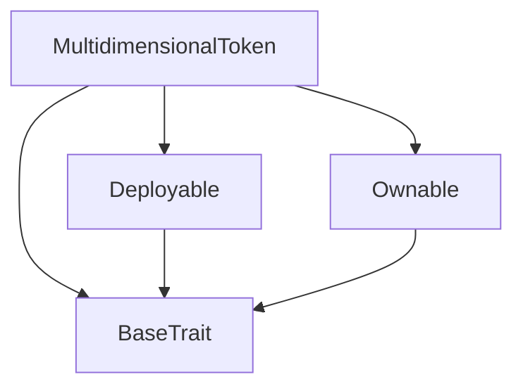
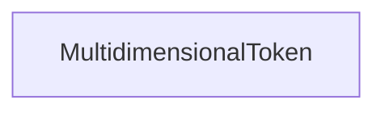

# Tact compilation report
Contract: MultidimensionalToken
BoC Size: 2752 bytes

## Structures (Structs and Messages)
Total structures: 24

### DataSize
TL-B: `_ cells:int257 bits:int257 refs:int257 = DataSize`
Signature: `DataSize{cells:int257,bits:int257,refs:int257}`

### SignedBundle
TL-B: `_ signature:fixed_bytes64 signedData:remainder<slice> = SignedBundle`
Signature: `SignedBundle{signature:fixed_bytes64,signedData:remainder<slice>}`

### StateInit
TL-B: `_ code:^cell data:^cell = StateInit`
Signature: `StateInit{code:^cell,data:^cell}`

### Context
TL-B: `_ bounceable:bool sender:address value:int257 raw:^slice = Context`
Signature: `Context{bounceable:bool,sender:address,value:int257,raw:^slice}`

### SendParameters
TL-B: `_ mode:int257 body:Maybe ^cell code:Maybe ^cell data:Maybe ^cell value:int257 to:address bounce:bool = SendParameters`
Signature: `SendParameters{mode:int257,body:Maybe ^cell,code:Maybe ^cell,data:Maybe ^cell,value:int257,to:address,bounce:bool}`

### MessageParameters
TL-B: `_ mode:int257 body:Maybe ^cell value:int257 to:address bounce:bool = MessageParameters`
Signature: `MessageParameters{mode:int257,body:Maybe ^cell,value:int257,to:address,bounce:bool}`

### DeployParameters
TL-B: `_ mode:int257 body:Maybe ^cell value:int257 bounce:bool init:StateInit{code:^cell,data:^cell} = DeployParameters`
Signature: `DeployParameters{mode:int257,body:Maybe ^cell,value:int257,bounce:bool,init:StateInit{code:^cell,data:^cell}}`

### StdAddress
TL-B: `_ workchain:int8 address:uint256 = StdAddress`
Signature: `StdAddress{workchain:int8,address:uint256}`

### VarAddress
TL-B: `_ workchain:int32 address:^slice = VarAddress`
Signature: `VarAddress{workchain:int32,address:^slice}`

### BasechainAddress
TL-B: `_ hash:Maybe int257 = BasechainAddress`
Signature: `BasechainAddress{hash:Maybe int257}`

### Deploy
TL-B: `deploy#946a98b6 queryId:uint64 = Deploy`
Signature: `Deploy{queryId:uint64}`

### DeployOk
TL-B: `deploy_ok#aff90f57 queryId:uint64 = DeployOk`
Signature: `DeployOk{queryId:uint64}`

### FactoryDeploy
TL-B: `factory_deploy#6d0ff13b queryId:uint64 cashback:address = FactoryDeploy`
Signature: `FactoryDeploy{queryId:uint64,cashback:address}`

### ChangeOwner
TL-B: `change_owner#819dbe99 queryId:uint64 newOwner:address = ChangeOwner`
Signature: `ChangeOwner{queryId:uint64,newOwner:address}`

### ChangeOwnerOk
TL-B: `change_owner_ok#327b2b4a queryId:uint64 newOwner:address = ChangeOwnerOk`
Signature: `ChangeOwnerOk{queryId:uint64,newOwner:address}`

### SplitMsg
TL-B: `split_msg#89083c5e amount1:int257 amount2:int257 = SplitMsg`
Signature: `SplitMsg{amount1:int257,amount2:int257}`

### UpdateQualityMsg
TL-B: `update_quality_msg#c30c48f9 quality_score:int257 audit_status:int257 = UpdateQualityMsg`
Signature: `UpdateQualityMsg{quality_score:int257,audit_status:int257}`

### UpdateLegalMsg
TL-B: `update_legal_msg#750e0f05 legal_status:int257 compliance_hash:int257 = UpdateLegalMsg`
Signature: `UpdateLegalMsg{legal_status:int257,compliance_hash:int257}`

### IdentityRoot
TL-B: `_ token_id:int257 owner:address minter:address created_at:int257 = IdentityRoot`
Signature: `IdentityRoot{token_id:int257,owner:address,minter:address,created_at:int257}`

### StateRoot
TL-B: `_ is_active:bool generation:int257 parent_id:int257 total_supply:int257 = StateRoot`
Signature: `StateRoot{is_active:bool,generation:int257,parent_id:int257,total_supply:int257}`

### QualityRoot
TL-B: `_ quality_score:int257 audit_status:int257 verification_count:int257 = QualityRoot`
Signature: `QualityRoot{quality_score:int257,audit_status:int257,verification_count:int257}`

### LegalRoot
TL-B: `_ legal_status:int257 compliance_hash:int257 jurisdiction_code:int257 = LegalRoot`
Signature: `LegalRoot{legal_status:int257,compliance_hash:int257,jurisdiction_code:int257}`

### LineageRoot
TL-B: `_ lineage_depth:int257 split_count:int257 = LineageRoot`
Signature: `LineageRoot{lineage_depth:int257,split_count:int257}`

### MultidimensionalToken$Data
TL-B: `_ owner:address identity:IdentityRoot{token_id:int257,owner:address,minter:address,created_at:int257} state:StateRoot{is_active:bool,generation:int257,parent_id:int257,total_supply:int257} quality:QualityRoot{quality_score:int257,audit_status:int257,verification_count:int257} legal:LegalRoot{legal_status:int257,compliance_hash:int257,jurisdiction_code:int257} lineage:LineageRoot{lineage_depth:int257,split_count:int257} last_update:int257 = MultidimensionalToken`
Signature: `MultidimensionalToken{owner:address,identity:IdentityRoot{token_id:int257,owner:address,minter:address,created_at:int257},state:StateRoot{is_active:bool,generation:int257,parent_id:int257,total_supply:int257},quality:QualityRoot{quality_score:int257,audit_status:int257,verification_count:int257},legal:LegalRoot{legal_status:int257,compliance_hash:int257,jurisdiction_code:int257},lineage:LineageRoot{lineage_depth:int257,split_count:int257},last_update:int257}`

## Get methods
Total get methods: 12

## getState
No arguments

## getIdentity
No arguments

## getQuality
No arguments

## getLegal
No arguments

## getLineage
No arguments

## isStale
No arguments

## getTimeSinceLastUpdate
No arguments

## getTimeUntilStale
No arguments

## isActive
No arguments

## getGeneration
No arguments

## getTotalSupply
No arguments

## owner
No arguments

## Exit codes
* 2: Stack underflow
* 3: Stack overflow
* 4: Integer overflow
* 5: Integer out of expected range
* 6: Invalid opcode
* 7: Type check error
* 8: Cell overflow
* 9: Cell underflow
* 10: Dictionary error
* 11: 'Unknown' error
* 12: Fatal error
* 13: Out of gas error
* 14: Virtualization error
* 32: Action list is invalid
* 33: Action list is too long
* 34: Action is invalid or not supported
* 35: Invalid source address in outbound message
* 36: Invalid destination address in outbound message
* 37: Not enough Toncoin
* 38: Not enough extra currencies
* 39: Outbound message does not fit into a cell after rewriting
* 40: Cannot process a message
* 41: Library reference is null
* 42: Library change action error
* 43: Exceeded maximum number of cells in the library or the maximum depth of the Merkle tree
* 50: Account state size exceeded limits
* 128: Null reference exception
* 129: Invalid serialization prefix
* 130: Invalid incoming message
* 131: Constraints error
* 132: Access denied
* 133: Contract stopped
* 134: Invalid argument
* 135: Code of a contract was not found
* 136: Invalid standard address
* 138: Not a basechain address
* 13800: Split amounts must equal total supply
* 18760: Quality score must be 0-100
* 33376: Token is burned
* 44380: Token is STALE
* 45438: Below minimum dust limit
* 49469: Access denied
* 55834: Only owner can initiate split

## Trait inheritance diagram

## Contract dependency diagram

