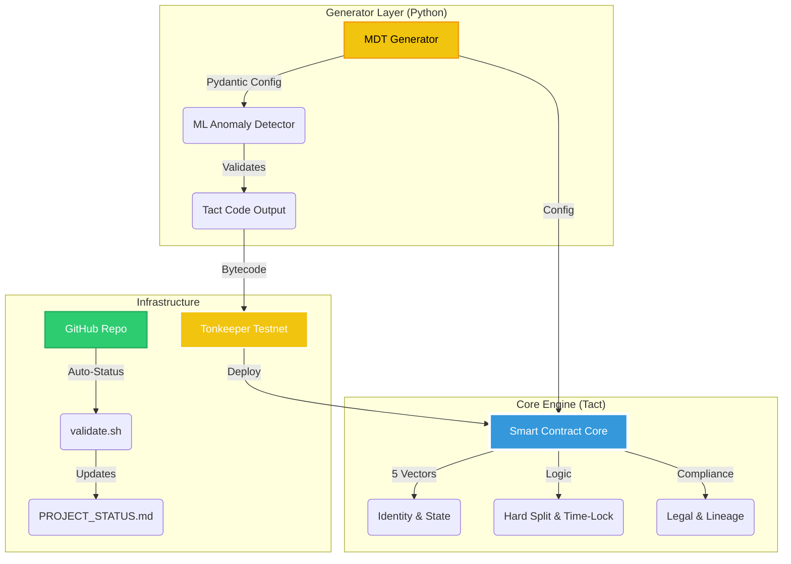

# 🏗️ PhormS-MDT Interactive Architecture

> This diagram is auto-generated from code structure. 
> **Green** = Completed, **Yellow** = In Progress, **Gray** = Planned.

## 🗺️ Development Roadmap

| Phase | Component | Status | Description |
| :--- | :--- | :--- | :--- |
| 1 | Core Contract | ✅ Done | Tact v1.4, 5-vector logic |
| 2 | Automation | ✅ Done | Health checks, auto-status |
| 3 | Deployment | 🔄 Active | Testnet upload via Tonkeeper |
| 4 | Frontend | ⏳ Planned | React dashboard for RWA |
